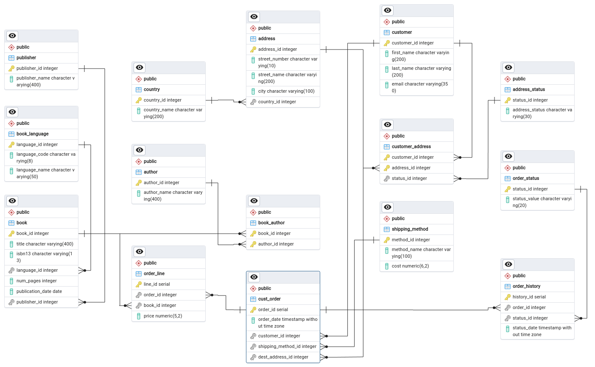

# PacBook Datastorage Case

## 1. Software Requirements

## 2. Source Data
### Initialization

Source data repository is in https://github.com/ihdarsyd/pacbook_store .

To clone it in your local computer, use:
```bash
git lfs clone https://github.com/ihdarsyd/pacbook_store.git
```

Then `cd` into the cloned directory, and run the docker-compose.yml file by using this command:
```bash
docker compose up -d
```
Wait until the init.sql fully loaded by checking using `docker compose logs` periodically.

Access the database using database administrator application like pgadmin or dbeaver to port 5433.

#### Source Data ERD



### Source Data Quality
Data source quality check was done using SQL script.

#### Data type

Data type of each column in all tables are appropriate for data that is contained. 

#### Duplication
There are some duplicated data in table country, book_author and publisher.

#### Null values

There is no null values for each table.

## 3. Requirements Gathering
### Description

Pacbook Store database stores customer orders of books. It have detailed information to support order's data. The main table to record order is cust_order table. After customer's order is recorded, then the order will be given a status. Order status will be updated according to order's delivery progress, cancelled or returned.

Not all orders can be recorded as sales. Because revenue recognition is not stated in the case, I use common recognition criteria that an ordered item need to be received by customer (order status delivered). Net sales also affected by returned items, so order status returned will reduce sales to get net sales.

### Problem

The company want to separate transaction data storage and data analysis storage.

### Solution

Build data warehouse with dimensional model and ELT process to gather data from source. 

## 4. Data Warehouse Design
### Dimensional Design Process

#### Business Process and Performance Metrics

| Business Process | Performance Metric | 
| --- | --- |
| Orders |  | 
| Sales |  <p> Monthly sales trends </p> <p> A list of books and their total sales quantity over time </p> <p> Average time taken for repeat orders </p> <p> Identifying distinct groups of customers based on their purchasing behavior, demographics, or other criteria. </p> <p> Determining the profitability of different products, customer segments, or sales channels to optimize business strategies. </p> <p> Predicting future sales trends and demand to optimize inventory levels and resource allocation. </p> |


#### Grain, Dimensions and Facts

Here are grain, dimensions, and facts for the sales business process:

<ol>

<li> Metric: Monthly sales trends
<p>Grain: A single data represent monthly
</p>
Dimension:
<ul>
<li>dim_status
</li>
<li>dim_date
</li>
</ul>
Fact
</li>
<li> Metric: A list of books and their total sales quantity over time
<p>Grain: 
</p>

</li>
<li> Metric: Average time taken for repeat orders

</li>
<li> Metric: Identifying distinct groups of customers based on their purchasing behavior, demographics, or other criteria.

</li>
<li> Metric: Determining the profitability of different products, customer segments, or sales channels to optimize business strategies.

</li>
<li> Metric: Predicting future sales trends and demand to optimize inventory levels and resource allocation.

</li>
</ol>
